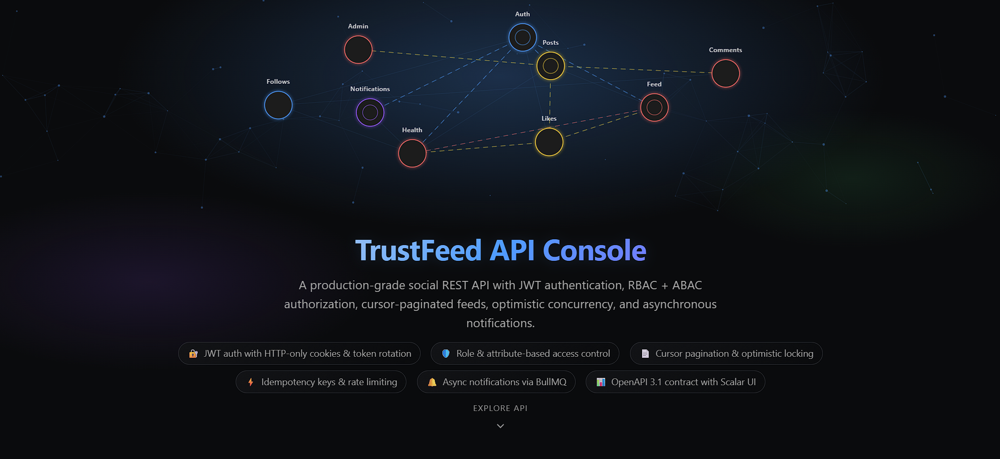
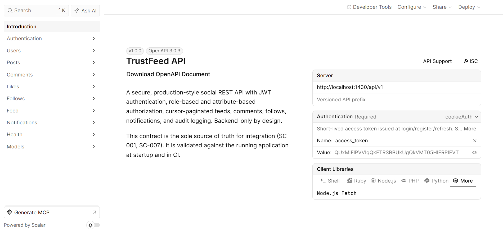
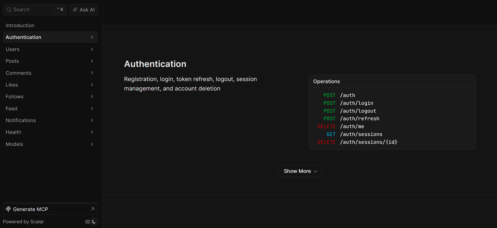
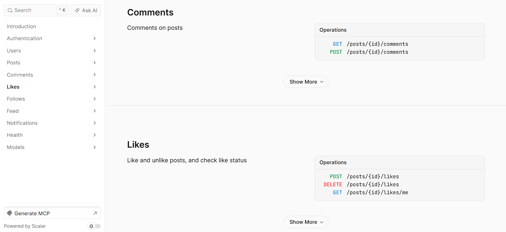
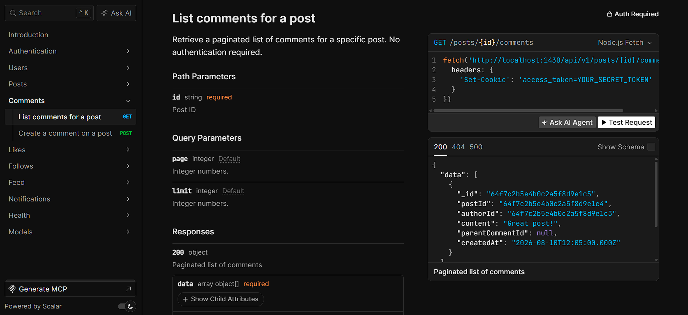
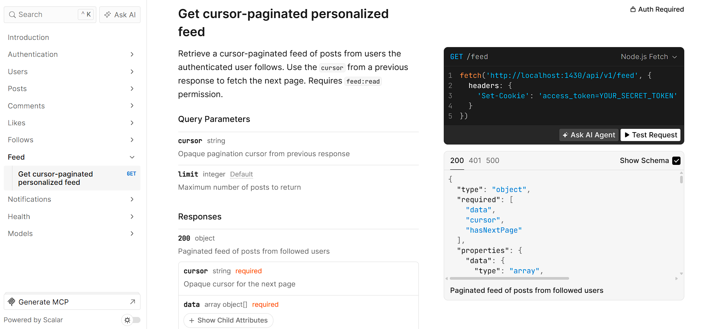
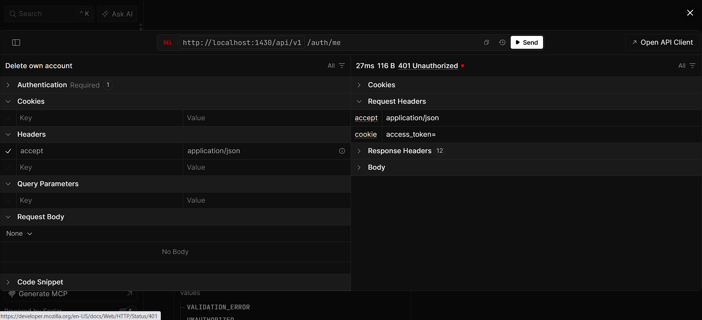

# TrustFeed API

A production-grade, secure REST API built with Node.js, Express 5, and MongoDB. Demonstrates clean architecture with repository pattern, JWT authentication with HTTP-only cookies, token refresh/rotation with Redis blacklist, RBAC + ABAC authorization, ownership-based access control, Zod request validation, idempotency, Redis-backed rate limiting, correlation IDs, structured logging, metrics, and asynchronous notifications via BullMQ. Backend-only by design — no UI.

> Backend only. No UI by design. The API is consumed by clients built from the OpenAPI contract.

<p align="center">
  
</p>

<p align="center">
  
  
  
  
  
  
  
</p>

---

## Table of Contents

- [Why This Project Exists](#why-this-project-exists)
- [Project Goals](#project-goals)
- [Problems It Solves](#problems-it-solves)
- [Implementation Status](#implementation-status)
- [Key Features](#key-features)
- [Architecture](#architecture)
- [Tech Stack](#tech-stack)
- [Folder Structure](#folder-structure)
- [API Surface](#api-surface)
- [Authentication, Authorization & Ownership](#authentication-authorization--ownership)
- [Rate Limiting](#rate-limiting)
- [Error Model](#error-model)
- [CORS & API Contract](#cors--api-contract)
- [Repository Pattern & Persistence Swap](#repository-pattern--persistence-swap)
- [Testing Strategy](#testing-strategy)
- [Environment Variables](#environment-variables)
- [Running Locally](#running-locally)
- [Adding a New Resource](#adding-a-new-resource)
- [Performance Targets](#performance-targets)
- [License](#license)
- [Author](#author)

## App Screenshots

[](assets/screenshots/TF_1.png)
[](assets/screenshots/TF_2.png)
[](assets/screenshots/TF_3.png)
[](assets/screenshots/TF_4.png)
[](assets/screenshots/TF_5.png)
[](assets/screenshots/TF_6.png)
[](assets/screenshots/TF_7.png)

---

## Why This Project Exists

Most portfolio REST APIs stop at "register, login, CRUD". That proves the obvious. They don't prove you can:

- Keep business rules independent of the framework, database, or transport.
- Resist a security review without breaking legitimate traffic.
- Add a feature without rewriting or risking existing endpoints.
- Give consumers a stable, machine-readable contract they can code against.
- Fail predictably when dependencies misbehave.
- Deliver asynchronous side effects (notifications) with bounded retry and dead-letter handling.

This project does. It is structured so a technical evaluator can verify the architecture from the directory layout alone.

---

## Project Goals

1. **Clean Architecture & SOLID.** Domain logic is isolated from transport (Express), persistence (Mongoose), and external services (Redis, BullMQ). Dependencies point inward.
2. **Extensibility without regression.** Adding a new resource means creating new files in a documented pattern. Existing handlers, services, and routes are not modified.
3. **Defense-in-depth security.** JWT with HTTP-only cookies, rotating refresh tokens with a Redis-backed blacklist, bcrypt-hashed passwords, per-caller rate limiting, RBAC, and ownership checks on every mutating operation.
4. **Stable, machine-readable API contract.** Every public endpoint is documented in a versioned OpenAPI YAML. The contract is the source of truth for integration.
5. **Testable at every layer.** Unit, integration, performance, and end-to-end tests cover the domain rules, the HTTP boundary, the rate limiter, and the contract.
6. **Predictable failure.** A flat error envelope with stable codes and trace references. No hidden retries, no silent fallbacks, no category fields.
7. **CORS-ready for browser clients.** Environment-driven origin allowlist with credentials and preflight handled correctly.
8. **Durable background processing.** Social events (follow, like, comment) are delivered asynchronously via BullMQ with bounded retry, exponential backoff, and dead-letter queuing.

---

## Problems It Solves

| Problem                                        | How this project addresses it                                                                        |
| ---------------------------------------------- | ---------------------------------------------------------------------------------------------------- |
| Business rules coupled to Express and Mongoose | Services depend only on repository interfaces; controllers stay thin                                 |
| Every feature change risks regressions         | New resources are added by creating new files; existing code is untouched                            |
| Brute-force login attacks                      | Per-IP login limiter (default 5 / 5 min) backed by Redis                                             |
| Token theft via XSS                            | Tokens stored in HTTP-only cookies; never readable from JavaScript                                   |
| Stale refresh tokens reused after theft        | Refresh tokens are rotated and added to a Redis blacklist with TTL                                   |
| A user modifying someone else's data           | Ownership is enforced in the service layer on every mutating operation                               |
| All-or-nothing admin access                    | Runtime-configurable RBAC with role and permission CRUD                                              |
| Consumers integrating against outdated docs    | OpenAPI YAML is the contract; it is updated alongside the implementation                             |
| Undiagnosable errors for callers               | Flat error envelope: `code`, `message`, `traceId`. Stable codes, no retry guidance baked in          |
| Silent failures when MongoDB or Redis is down  | Fail-fast: dependency errors are detected and returned as `DEPENDENCY_FAILURE` with a 503            |
| N+1 queries degrading list endpoints           | Repositories batch their lookups; pagination is enforced at the service boundary                     |
| Slow APIs under load                           | Sub-second p95 target under 1000 concurrent authenticated requests; performance tests gate the build |
| Browser clients blocked by CORS                | Environment-driven origin allowlist with credentials and preflight handling                          |
| Lost notifications when queue backends fail    | Inline fallback preserves bounded retry and dead-letter semantics                                    |
| No audit trail for security events             | Audit events are persisted via the AuditLog repository with correlation IDs                          |

---

## Key Features

**Architecture**

- Clean architecture: `routes → controllers → services → repositories → models`
- Repository pattern with Mongoose implementations
- Centralized configuration (`src/configs/config.js`) — no scattered `process.env`
- Zod-based request validation at the HTTP boundary
- Documented extension pattern (`src/docs/extension-pattern.md`) for adding new resources without modifying existing files
- Hot-path Big-O complexity documented in code comments
- Idempotency via `Idempotency-Key` header (Redis-backed dedup, 7-day TTL)
- Correlation IDs via `X-Correlation-Id` header (AsyncLocalStorage propagation)
- In-memory metrics (request volume, duration histograms, auth outcomes)

**Security**

- JWT authentication (HTTP-only cookies, never exposed to JS)
- Refresh token rotation with Redis-backed blacklist and TTL
- Session revocation via `sid` claim in access tokens
- Session model with idle TTL and periodic sweep
- bcrypt password hashing; secrets excluded from responses and logs
- Per-caller rate limiting (authenticated by `userId`, public by IP)
- Strict login limiter to deter credential stuffing
- Social mutation limiter for follow/like/comment endpoints
- RBAC middleware (`requirePermission`) with optional inline ABAC attributes
- ABAC policy predicates evaluated per request via `requirePermission(..., { attributes })`
- Ownership checks in the service layer on every mutating operation
- Structured logger that redacts secrets and PII
- Audit logging for security-relevant events (token reuse, mutations)
- Dev seed data for roles and permissions (`configs/seed.js`) bootstrapped in development mode
- Admin API for runtime role and permission CRUD

**Social Features**

- Follow / unfollow users with atomic operations
- Like / unlike posts with uniqueness enforcement
- Cursor-paginated personalized feed of followed users' posts
- Redis write-fanout cache for hot feed reads
- Comments on posts with optimistic locking
- Asynchronous notifications for follow, like, and comment events
- BullMQ worker with bounded retry, exponential backoff, and dead-letter queue
- Inline fallback runner when queue backend is unavailable

**API Quality**

- Versioned, machine-readable OpenAPI specification as the integration contract
- Flat error model with stable codes and trace references
- Fail-fast behavior on dependency failures (no silent retries)
- CORS with environment-driven origin allowlist and credentials
- Graceful shutdown with bounded timeouts for HTTP and background jobs

**Data**

- MongoDB via Mongoose for application data
- Pagination on list endpoints
- Indexes declared at the repository layer and built explicitly at startup
- N+1 queries audited and prevented on post list endpoints; population is batched

**Testing**

- Vitest integration tests against `mongodb-memory-server` + Supertest (architecture, contract, CORS, errors, RBAC, auth, sessions, follow, like, notifications, rate limit)
- Performance tests for pagination, rate-limit latency, feed cache hit rate, and load (p95 < 950ms)
- `tests/unit/` reserved for future pure unit tests (services against in-memory repositories, validators, pure functions)

---

## Architecture

### Layered model

```
HTTP Request
    │
    ▼
routes ──► middleware (auth, RBAC, rate limit, validation, CORS)
    │
    ▼
controllers ──► thin: parse input, call service, return response envelope
    │
    ▼
services ──► business rules; depend only on repository interfaces
    │
    ▼
repositories ──► persistence boundary; Mongoose today, anything tomorrow
    │
    ▼
models / Redis / BullMQ
```

### Dependency rules

- **Controllers** never import Mongoose models or talk to Redis directly.
- **Services** depend only on repository **interfaces**, not on Mongoose.
- **Repositories** isolate persistence and own indexes and query batching.
- **Middleware** handles cross-cutting concerns (auth, RBAC, rate limit, CORS, validation, error mapping).
- **Models** are pure schemas; no service logic.
- **Workers** handle durable background processing; services publish jobs through a queue facade.

The result: you can swap Mongoose for SQL, replace Redis with another store, or move from Express to another framework without rewriting business rules.

See [`backend/src/docs/extension-pattern.md`](backend/src/docs/extension-pattern.md) for the full step-by-step guide.

---

## Tech Stack

| Concern                      | Choice                                                                        |
| ---------------------------- | ----------------------------------------------------------------------------- |
| Runtime                      | Node.js ≥ 20 with ES modules (`"type": "module"`)                             |
| HTTP framework               | Express 5                                                                     |
| Application database         | MongoDB via Mongoose 9 (app data)                                             |
| Cache / rate-limit store     | Redis via ioredis                                                             |
| Background queue             | BullMQ with Redis backend (notifications, bounded retry, dead-letter)         |
| Rate limiting                | `express-rate-limit` + `rate-limit-redis` (per-caller keys: `userId` or IP)   |
| Authentication               | `jsonwebtoken` (access + refresh), HTTP-only cookies                          |
| Password hashing             | `bcrypt`                                                                      |
| Request validation           | Zod schemas at the controller boundary                                        |
| Logging                      | Custom structured logger (`src/utils/logger.js`)                              |
| Configuration                | Centralized env access (`src/configs/config.js`) — no scattered `process.env` |
| Testing — unit & integration | Vitest + Supertest + `mongodb-memory-server`                                  |
| Testing — performance        | Vitest (pagination throughput, rate-limit fairness, cache hit rate, load)     |
| Testing — end-to-end         | Vitest + Supertest (auth flows, post CRUD, social flows)                      |

---

## Folder Structure

```
backend/
├── src/
│   ├── app.js                      Express app wiring
│   ├── index.js                    Server entrypoint + seed bootstrap
│   ├── configs/
│   │   ├── config.js               Centralized env access
│   │   ├── constants.js            Rate-limit & token constants
│   │   ├── cors.js                 Environment-driven origin allowlist
│   │   ├── database.js             Mongoose connection + index build
│   │   ├── redis.js                ioredis singleton
│   │   └── seed.js                 Dev seed for roles & permissions
│   ├── controller/
│   │   ├── auth.controller.js      Session list/revoke
│   │   ├── comment.controller.js   Comment CRUD
│   │   ├── error.controller.js     404 handler
│   │   ├── follow.controller.js    Follow/unollow
│   │   ├── health.controller.js    Liveness & readiness probes
│   │   ├── like.controller.js      Like/unlike
│   │   ├── notification.controller.js  Notification list/read
│   │   ├── post.controller.js      Post CRUD + feed
│   │   ├── refresh_token.controller.js — token rotation
│   │   └── user.controller.js      Registration, login, logout, delete
│   ├── controllers/
│   │   └── admin.controller.js     Role & permission CRUD
│   ├── docs/
│   │   ├── extension-pattern.md    How to add a new resource
│   │   ├── console.html            Interactive Scalar-powered API console
│   │   ├── console.css             Console theme and layout styles
│   │   ├── resolve-openapi.js      Resolves multi-file contract to JSON at runtime
│   │   └── openapi/
│   │       └── contract-check.js   Validates implementation matches contract
│   ├── middleware/
│   │   ├── auth.middleware.js      JWT verify + blacklist + user/permissions attach
│   │   ├── authlimiter.middleware.js  Strict login limiter
│   │   ├── correlation.middleware.js  AsyncLocalStorage correlation IDs
│   │   ├── cors.middleware.js
│   │   ├── error.middleware.js     Fail-fast + envelope shaping
│   │   ├── idempotency.middleware.js  Redis-backed dedup via Idempotency-Key
│   │   ├── ratelimiter.middleware.js   Global API limiter + social mutation limiter
│   │   ├── role.middleware.js      RBAC (requirePermission) + inline ABAC
│   │   └── validate.middleware.js  Zod validation
│   ├── models/
│   │   ├── audit-log.model.js
│   │   ├── comment.model.js
│   │   ├── follow.model.js
│   │   ├── like.model.js
│   │   ├── notification.model.js
│   │   ├── permission.model.js
│   │   ├── post.model.js
│   │   ├── role.model.js
│   │   ├── session.model.js
│   │   └── user.model.js
│   ├── repositories/
│   │   ├── interfaces/             Pure abstract contracts (no ORM)
│   │   │   ├── audit-log.repository.js
│   │   │   ├── comment.repository.js
│   │   │   ├── follow.repository.js
│   │   │   ├── like.repository.js
│   │   │   ├── notification.repository.js
│   │   │   ├── permission.repository.js
│   │   │   ├── post.repository.js
│   │   │   ├── role.repository.js
│   │   │   ├── session.repository.js
│   │   │   └── user.repository.js
│   │   └── implementations/
│   │       └── mongoose/           Production Mongoose-backed implementations
│   │           ├── audit-log.repository.js
│   │           ├── comment.repository.js
│   │           ├── follow.repository.js
│   │           ├── like.repository.js
│   │           ├── notification.repository.js
│   │           ├── permission.repository.js
│   │           ├── post.repository.js
│   │           ├── role.repository.js
│   │           ├── session.repository.js
│   │           └── user.repository.js
│   ├── routes/
│   │   ├── admin.routes.js         Role & permission management
│   │   ├── auth.routes.js          Register, login, refresh, session management
│   │   ├── comment.routes.js       Comments on posts
│   │   ├── follow.routes.js        Follow / unfollow users
│   │   ├── like.routes.js          Like / unlike posts
│   │   ├── notification.routes.js  Notifications
│   │   ├── post.routes.js          Post CRUD
│   │   └── user.routes.js          Account management
│   ├── service/
│   │   ├── audit.service.js        Audit event writer (wired in app.js)
│   │   ├── auth.service.js         Registration, login, delete, JTI generation
│   │   ├── comment.service.js      Comment CRUD with optimistic locking
│   │   ├── error.service.js        Classifies errors, generates traceId
│   │   ├── feed.service.js         Cursor-paginated feed with Redis write-fanout cache
│   │   ├── follow.service.js       Atomic follow/unfollow with notification dispatch
│   │   ├── like.service.js         Like/unlike with uniqueness enforcement
│   │   ├── notification.queue.js   Queue facade for notification jobs
│   │   ├── notification.service.js Notification delivery
│   │   ├── post.service.js         Post CRUD with ownership checks + audit
│   │   └── session.service.js      Session management + idle sweep
│   ├── utils/
│   │   ├── errors.js               Stable error codes & envelope definitions
│   │   ├── generateToken.js        JWT access + refresh generation
│   │   ├── logger.js               Structured JSON logger (redacts secrets/PII)
│   │   ├── metrics.js              In-memory counters + duration histograms
│   │   └── response.js             JSON envelope helper
│   ├── validators/
│   │   ├── admin.validator.js      Role & permission schemas
│   │   ├── auth.validator.js       Register, login schemas
│   │   ├── comment.validator.js    Comment schemas
│   │   ├── follow.validator.js     Follow schemas
│   │   ├── like.validator.js       Like schemas
│   │   ├── notification.validator.js  Notification schemas
│   │   ├── post.validator.js       Create, update schemas
│   │   ├── session.validator.js    Session schemas
│   │   └── user.validator.js       Assign roles schema
│   └── workers/
│       └── notification.worker.js  BullMQ worker + inline fallback for notifications
├── tests/
│   ├── global-setup.js             mongodb-memory-server bootstrap
│   ├── helpers/                    Shared test utilities (fixtures, request helper)
│   ├── integration/                API + DB integration (auth, RBAC, ownership, errors, CORS, contract, sessions, follow, like, notifications, rate limit)
│   ├── performance/                Feed cache, pagination, rate-limit latency, load (p95 < 950ms)
│   └── e2e/                        End-to-end flows (auth flows, post CRUD, social flows)
├── postman/                        Newman/Postman collections for E2E API validation
├── vitest.config.js
├── package.json
└── .env                            (not committed)
```

---

## API Surface

All routes are prefixed with `/api/v1`.

### Auth

| Method   | Path                 | Description              |
| -------- | -------------------- | ------------------------ |
| `POST`   | `/auth/`             | Register a new user      |
| `POST`   | `/auth/login`        | Login (rate-limited)     |
| `POST`   | `/auth/logout`       | Invalidate refresh token |
| `POST`   | `/auth/refresh`      | Rotate refresh token     |
| `DELETE` | `/auth/me`           | Delete own account       |
| `GET`    | `/auth/sessions`     | List own sessions        |
| `DELETE` | `/auth/sessions/:id` | Revoke a single session  |

### Users

| Method | Path               | Description                  |
| ------ | ------------------ | ---------------------------- |
| `GET`  | `/users/`          | List users (admin)           |
| `GET`  | `/users/:id`       | Get user by ID (admin)       |
| `POST` | `/users/:id/roles` | Assign roles to user (admin) |

### Posts (authenticated)

| Method   | Path         | Description     |
| -------- | ------------ | --------------- |
| `POST`   | `/posts`     | Create a post   |
| `GET`    | `/posts/me`  | List own posts  |
| `GET`    | `/posts`     | List all posts  |
| `PATCH`  | `/posts/:id` | Update own post |
| `DELETE` | `/posts/:id` | Delete own post |

### Comments (authenticated)

| Method | Path                  | Description             |
| ------ | --------------------- | ----------------------- |
| `POST` | `/posts/:id/comments` | Comment on a post       |
| `GET`  | `/posts/:id/comments` | List comments on a post |

### Follows (authenticated)

| Method   | Path                  | Description     |
| -------- | --------------------- | --------------- |
| `POST`   | `/users/:id/follow`   | Follow a user   |
| `DELETE` | `/users/:id/unfollow` | Unfollow a user |

### Likes (authenticated)

| Method   | Path                  | Description         |
| -------- | --------------------- | ------------------- |
| `POST`   | `/posts/:id/likes`    | Like a post         |
| `DELETE` | `/posts/:id/likes`    | Unlike a post       |
| `GET`    | `/posts/:id/likes/me` | Check if post liked |

### Feed (authenticated)

| Method | Path    | Description                        |
| ------ | ------- | ---------------------------------- |
| `GET`  | `/feed` | Cursor-paginated personalized feed |

### Notifications (authenticated)

| Method  | Path                      | Description               |
| ------- | ------------------------- | ------------------------- |
| `GET`   | `/notifications`          | List own notifications    |
| `PATCH` | `/notifications/:id/read` | Mark notification as read |

### Admin (authenticated, admin role required)

| Method   | Path                     | Description       |
| -------- | ------------------------ | ----------------- |
| `GET`    | `/admin/roles`           | List roles        |
| `GET`    | `/admin/roles/:id`       | Get role          |
| `POST`   | `/admin/roles`           | Create role       |
| `PATCH`  | `/admin/roles/:id`       | Update role       |
| `DELETE` | `/admin/roles/:id`       | Delete role       |
| `GET`    | `/admin/permissions`     | List permissions  |
| `GET`    | `/admin/permissions/:id` | Get permission    |
| `POST`   | `/admin/permissions`     | Create permission |
| `PATCH`  | `/admin/permissions/:id` | Update permission |
| `DELETE` | `/admin/permissions/:id` | Delete permission |

### Health (unprotected)

| Method | Path            | Description                     |
| ------ | --------------- | ------------------------------- |
| `GET`  | `/health`       | Liveness probe                  |
| `GET`  | `/health/ready` | Readiness probe (Mongo + Redis) |

The full contract — parameters, schemas, security schemes, error responses, and CORS — is published as a multi-file OpenAPI specification (canonical copy under `specs/002-trustfeed-social-api/contracts/`, published under `backend/src/docs/openapi/`, split by concern: `openapi.yaml`, `paths/`, and `components/` containing `schemas.yaml`, `responses.yaml`, `security.yaml`).

---

## Authentication, Authorization & Ownership

**Authentication** is JWT with two tokens:

- **Access token** — short-lived (default 5m), HTTP-only cookie (`access_token`), validated on every protected request.
- **Refresh token** — longer-lived (default 15m), HTTP-only cookie (`refresh_token`), rotated on every refresh. Old refresh tokens are blacklisted in Redis with TTL = remaining lifetime.
- **Session model**: each refresh token is tracked as a `Session` document with `jti`, `expiresAt`, and idle TTL. A background sweep removes inactive sessions per `SESSION_IDLE_TTL_SECONDS`.
- **Session revocation**: access tokens carry a `sid` claim; revoking a session writes `session:revoked:<sid>` in Redis.
- **Multi-session support**: each refresh token gets a unique `jti`.

**Authorization** is RBAC + inline ABAC:

- `Role` is a named collection of `Permission` codes (e.g. `posts:create`, `posts:delete`, `follows:create`, `likes:create`, `comments:create`, `feed:read`, `notifications:read`).
- Default seeded roles: `user` (`posts:read`, `posts:create`) and `admin` (all permissions). Roles and permissions are stored in the database, seeded on boot in development, and manageable at runtime via the `/admin` API.
- **RBAC middleware**: `requirePermission("posts:delete")` checks `req.user.permissions`.
- **Inline ABAC**: `requirePermission("posts:update", { attributes: ctx => ctx.user._id === ctx.params.id })` evaluates arbitrary predicates per request.
- Adding a new role or permission does not require touching endpoint code.

**Ownership** is enforced in the service layer:

- A user can only `PATCH` or `DELETE` their own posts.
- A deleted user's tokens become inert because the auth middleware re-resolves the user on every request.
- A revoked role or missing permission is re-evaluated per request — no cached authorization.

---

## Rate Limiting

Rate limits are enforced per caller using `express-rate-limit` with a Redis store. Defaults are overridable via environment variables.

| Scope                      | Default      | Window | Key         |
| -------------------------- | ------------ | ------ | ----------- |
| Global API (authenticated) | 200 requests | 15 min | `user:<id>` |
| Global API (public)        | 200 requests | 15 min | IP          |
| Login (`POST /auth/login`) | 5 requests   | 5 min  | IP          |
| Social mutations           | 60 requests  | 15 min | `user:<id>` |

When a caller exceeds their limit, the API returns `429` with a `RATE_LIMITED` error code. Limiter state is shared across processes because the store is Redis, so the system stays correct behind a load balancer.

---

## Error Model

All error responses use a **flat envelope** with three fields:

```json
{
  "code": "VALIDATION_ERROR",
  "message": "The request was invalid",
  "traceId": "8f4e1c6a-..."
}
```

Stable codes (defined in `src/utils/errors.js`):

| Code                   | HTTP | Meaning                                      |
| ---------------------- | ---- | -------------------------------------------- |
| `VALIDATION_ERROR`     | 400  | Request body or params failed validation     |
| `UNAUTHORIZED`         | 401  | Authentication required                      |
| `INVALID_CREDENTIALS`  | 401  | Bad email or password                        |
| `AUTH_REUSE_DETECTED`  | 401  | Refresh token reuse detected                 |
| `FORBIDDEN`            | 403  | Permission denied                            |
| `ROLE_DENIED`          | 403  | Required role or permission missing          |
| `OWNERSHIP_REQUIRED`   | 403  | Caller is not the resource owner             |
| `NOT_FOUND`            | 404  | Resource does not exist                      |
| `CONFLICT`             | 409  | State conflict (e.g. duplicate)              |
| `IDEMPOTENCY_CONFLICT` | 409  | Concurrent request with same idempotency key |
| `RATE_LIMITED`         | 429  | Rate limit exceeded                          |
| `DEPENDENCY_FAILURE`   | 503  | External dependency is unavailable           |
| `INTERNAL_ERROR`       | 500  | Unexpected error                             |

There is **no category field, no retry guidance, no HTTP-text duplication**. Consumers look up the stable code in the contract and decide their own retry policy. When a dependency (MongoDB, Redis) fails, the API returns `DEPENDENCY_FAILURE` immediately — it does not retry or fall back at the application layer.

---

## CORS & API Contract

**CORS** is configured via environment variables (no hardcoded origins):

```
ALLOWED_ORIGINS="https://app.example.com,https://admin.example.com"
```

Credentials are enabled and preflight (`OPTIONS`) is handled correctly, so browser clients can complete the full auth flow from any configured origin.

**Contract** — `specs/002-trustfeed-social-api/contracts/` is the canonical, machine-readable API description and the source of truth for integration; `backend/src/docs/openapi/` is the published copy, kept byte-identical via `npm run contract:sync`. It is a multi-file OpenAPI specification split into grouped files for maintainability:

- `openapi.yaml` — root document (info, servers, security, tags, and `$ref`s to the rest)
- `paths/auth.yaml`, `paths/posts.yaml`, `paths/comments.yaml`, `paths/follows.yaml`, `paths/likes.yaml`, `paths/feed.yaml`, `paths/notifications.yaml`, `paths/users.yaml`, `paths/health.yaml` — per-resource path definitions
- `components/schemas.yaml`, `components/responses.yaml`, `components/security.yaml`, `components/headers.yaml` — reusable components

After editing, sync and validate it:

```bash
npm run contract:sync   # regenerate backend/src/docs/openapi from the canonical copy
npm run contract:lint   # validate the published openapi.yaml
npm run contract:check  # verify implementation matches the contract
```

The implementation is checked against this contract.

---

## Repository Pattern & Persistence Swap

Services never import Mongoose. They import a repository interface and depend on the methods declared there. The production implementation lives at:

- `repositories/implementations/mongoose/` — production (Mongoose)

A memory implementation can be added at `repositories/implementations/memory/` for tests. To swap persistence (e.g. Mongoose → Prisma, Mongoose → SQL), implement the same interface and change the import in the service. Controllers, routes, middleware, and tests do not change.

---

## Testing Strategy

| Layer       | Tooling                                    | Scope                                                                                                      |
| ----------- | ------------------------------------------ | ---------------------------------------------------------------------------------------------------------- |
| Integration | Vitest + Supertest + mongodb-memory-server | API + DB: auth, RBAC, ownership, errors, CORS, contract, sessions, follow, like, notifications, rate limit |
| Performance | Vitest                                     | Feed cache hit rate, pagination throughput, rate-limit latency, load (p95 < 950ms)                         |
| End-to-end  | Vitest + Supertest + Newman/Postman | Auth flows, post CRUD, social flows |

The `tests/unit/` directory is reserved for future pure unit tests (services against in-memory repositories, validators, pure functions).

Commands:

```bash
# Integration + performance + e2e (vitest discovers tests in tests/)
npm test

# Watch mode
npm run test:watch

# Coverage
npm run test:coverage

# E2E with Postman collections
npm run e2e
```

Coverage targets are tracked by the test suite itself; the full suite must pass before any change is merged.

---

## API Console

An interactive API Console is served at `/console` when the backend is running. The root path `/` redirects to `/console`. It renders the published OpenAPI contract using Scalar, letting reviewers browse endpoints, inspect schemas, authenticate with their real TrustFeed cookie-based session, and execute requests without leaving the browser.

- **URL**: `http://localhost:1430/console`
- **OpenAPI source of truth**: `/console/openapi.json` (resolved from the canonical multi-file contract at runtime by `resolve-openapi.js`)
- **Authentication**: Uses the same HTTP-only cookies as the API (`access_token`, `refresh_token`). No demo credentials or auth bypasses are provided.
- **CORS**: Because the console is served from the same origin as the API, no cross-origin configuration is required for local development.

The console is a thin developer documentation surface served from the existing backend. It does not introduce a frontend framework, build step, or separate application, and it does not weaken the existing security model.

---

## Environment Variables

Create `backend/.env`:

```ini
# Server
PORT=1430
NODE_ENV=development

# Database
MONGODB_URI="your_mongodb_connection_string"

# Redis
REDIS_DB_URI="your_redis_connection_string"

# JWT
JWT_AUTH_KEY="replace_with_long_random_string"
JWT_REFRESH_KEY="replace_with_long_random_string"
JWT_ACCESS_EXPIRES_IN="5m"
JWT_REFRESH_EXPIRES_IN="15m"

# Rate limiting (optional overrides)
API_RATE_WINDOW_MS=900000
API_RATE_LIMIT=200
LOGIN_RATE_WINDOW_MS=300000
LOGIN_RATE_LIMIT=5
API_SOCIAL_RATE_WINDOW_MS=900000
API_SOCIAL_RATE_LIMIT=60

# CORS (comma-separated; required for CORS)
ALLOWED_ORIGINS="http://localhost:3000,https://app.example.com"

# Social features
BULLMQ_URL="redis://127.0.0.1:6379"
FEED_CACHE_TTL_SECONDS=300
SESSION_IDLE_TTL_SECONDS=2592000
IDEMPOTENCY_TTL_DAYS=7
HEALTH_TIMEOUT_MS=5000

# Graceful shutdown
GRACEFUL_SHUTDOWN_HTTP_TIMEOUT_MS=10000
GRACEFUL_SHUTDOWN_JOBS_TIMEOUT_MS=30000
```

See `backend/src/configs/config.js` for the canonical list.

---

## Running Locally

```bash
# 1. Install
cd backend
npm install

# 2. Configure
cp .env.example .env   # then edit values

# 3. Start (watch mode)
npm run dev            # nodemon
# or
npm run dev-watch      # node --watch

# 4. Verify
npm test
```

The server expects local Redis at startup; it will retry connection if Redis is temporarily unavailable. BullMQ uses the same Redis instance by default (`BULLMQ_URL` falls back to `REDIS_DB_URI`).

---

## Adding a New Resource

Follow the documented pattern in [`backend/src/docs/extension-pattern.md`](backend/src/docs/extension-pattern.md). The short version:

1. **Model** — `src/models/widget.model.js`
2. **Repository interface** — `src/repositories/interfaces/widget.repository.js`
3. **Mongoose implementation** — `src/repositories/implementations/mongoose/widget.repository.js`
4. **Validator** — `src/validators/widget.validator.js`
5. **Service** — `src/service/widget.service.js`
6. **Controller** — `src/controller/widget.controller.js`
7. **Routes** — `src/routes/widget.routes.js`
8. **Permissions & seed** — add codes to `configs/seed.js`; gate with `requirePermission(...)`
9. **Contract** — add the new resource's paths to `specs/002-trustfeed-social-api/contracts/paths/<resource>.yaml` and reference it from the canonical root `openapi.yaml`; add shared schemas to `contracts/components/schemas.yaml`. Then run `npm run contract:sync` and `npm run contract:lint`.

No existing file is modified.

---

## Performance Targets

Measured and enforced by `tests/performance/`:

- **p95 < 950 ms** for authenticated requests under 1000 concurrent consumers.
- Rate limiting is per-caller; one abusive source cannot monopolize capacity.
- No N+1 queries on list endpoints; population is batched at the repository layer.
- Pagination is enforced at the service boundary.
- Feed cache hit rate for hot post reads meets target (verified by `cache-hit-rate.test.js`).

---

## License

This is a **portfolio project — read & study only**.

You may read and study the code for learning purposes. You may **not** copy, reuse, redistribute, claim as your own, or use in production.

See [`license.md`](license.md) for full terms.

## Author

**Mohamed Hazeem**

- Email: a.mohamedhazeem@gmail.com
- GitHub: [@mohamedhazeem](https://github.com/Mohamedhazeem)
